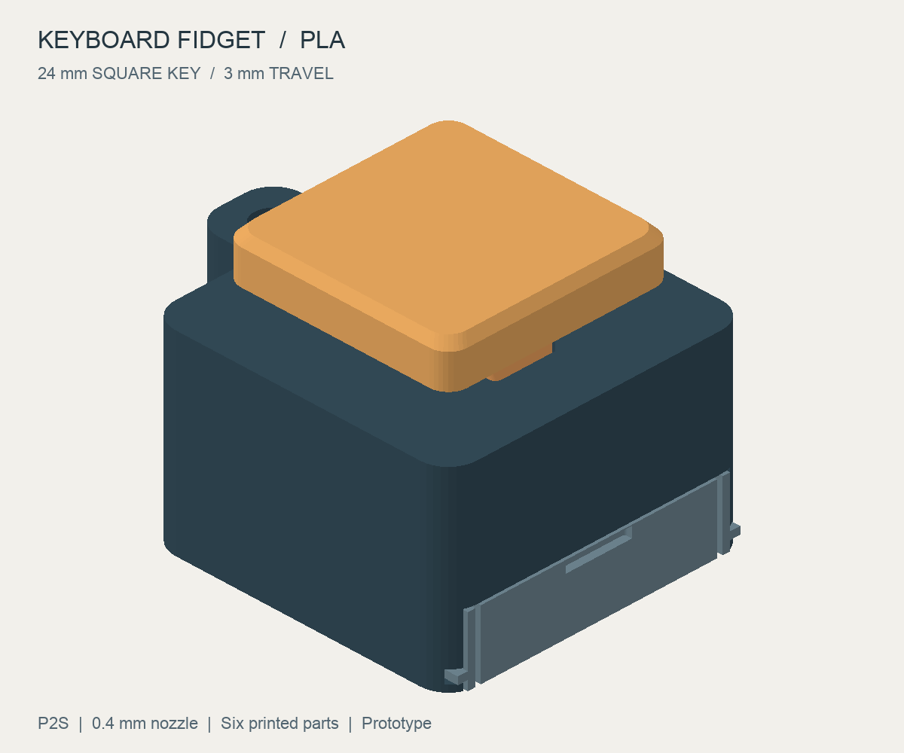
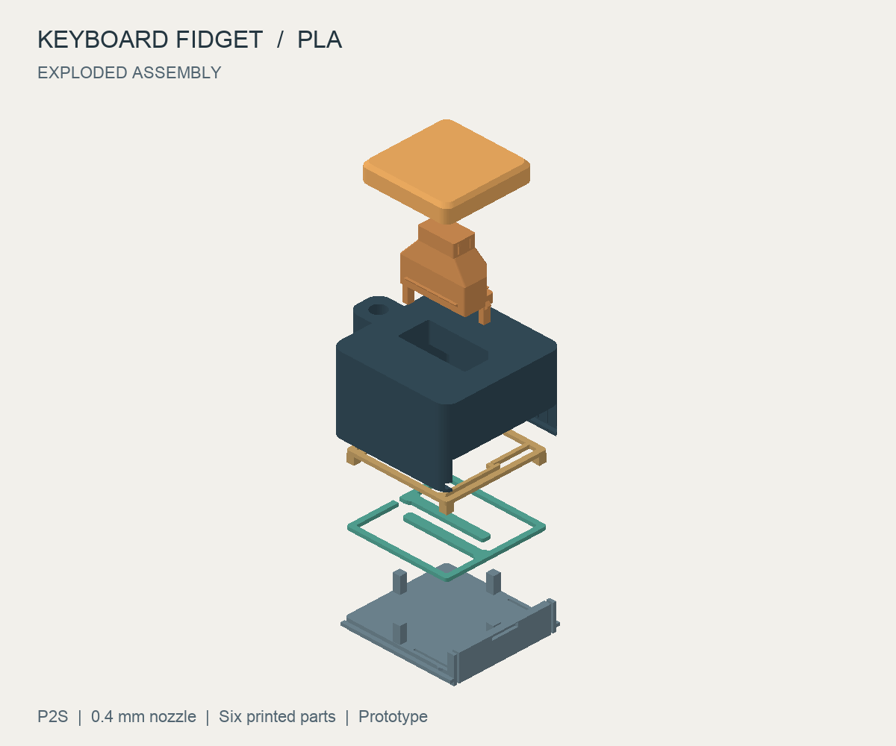

# 键盘解压按键器 · FDM

独立设计的方形单键解压器：方形键帽、凸轮段落弹舌、独立回弹片和钥匙圈挂孔。六个零件全部用 PLA 打印，不需要键盘轴、螺丝或金属弹簧。



| 参数 | 尺寸 / 配置 |
| --- | --- |
| 底座主体 | 32 × 32 mm，圆角 |
| 含挂耳外廓 | 39 × 32 mm |
| 装配高度 | 约 25 mm |
| 键帽 | 24 × 24 mm，边缘收坡 |
| 机械限位行程 | 3 mm |
| 挂孔 | 直径 4 mm，挂耳厚 5 mm，最窄孔边 2.4 mm |
| 导向间隙 | 单边 0.25 mm；一角削角防反装 |
| 回弹片 | 厚 0.8 mm，弹臂宽 2.4 mm |
| 段落弹舌 | 平面内弯曲，臂宽 0.8 mm、厚 0.8 mm |

## 先打印配合试片

先下载 [配合试片](fit-coupon.stl)，包含一个双孔量规和一个带插接头的试柱。长孔检查导向滑动，小盲孔检查键帽插接。

试柱的削角应对齐长孔削角，能用手推过、不明显卡滞。小插接头有微量过盈筋，插入小孔后应能保持，不能靠强压导致开裂。先清理象脚和接缝；仍不合适时调整源码的导向间隙或插接筋并重新生成，不要整体缩放模型。过盈筋可以少量打磨。

## 打印文件与设置

- [全部六件 · 打印排版](all-parts.stl)：约 118 × 76 mm，按 100% 比例导入 Bambu Studio；保持各件相对位置及既定朝向。
- 独立文件：[外壳](shell.stl)、[键帽](keycap.stl)、[导向柱](plunger.stl)、[滑动底盖](base.stl)、[备用回弹片](return-spring.stl)、[备用段落弹舌](click-spring.stl)。颜色自由，键帽可以单独换色打印。
- 选择 **拓竹 P2S、0.4 mm 喷嘴、PLA**；首层和后续层高均为 **0.20 mm**，3 圈墙，15% 填充，Arachne 墙生成器，关闭支撑。外墙速度 45 mm/s、内墙 80 mm/s 作为起点，材料温度沿用所用 PLA 配置。
- 外壳顶面、键帽顶面、导向柱插接头端、段落件的弹臂面朝下；底盖和回弹片平放。不要自动定向。
- 两类弹性件的有效薄片均为 4 层。检查两条长回弹臂及 0.8 mm 段落臂连续成形；不要把外壳或键帽的填充比例套用为“弹臂内部可以缺料”。
- 局部悬挑包括导向柱防脱肩、凸轮坡面和底盖导轨；切片验证记录见 [切片报告](slicing-validation.json)。
- 打印完成冷却后取件。尤其清理弹舌与敲击止挡之间约 0.35 mm 的间隙；若被挤出线黏连，不要强行掰开，应先调整流量或增大止挡间隙后重打该件。

用料、耗时、弹性件路径检查及软件诊断见 [切片报告](slicing-validation.json)。重建后切片状态重置为 `not-run`。

## 装配



爆炸图从上到下依次为键帽、导向柱、外壳、段落弹舌、回弹片、底盖。图中弹性件显示未受力状态。

1. 外壳翻面，开口朝上。将导向柱的插接头从壳内穿过长导向孔；削角只有一个正确方向，两个防脱肩留在壳内。
2. 放入段落弹舌：四个短脚朝壳底，框架缺口对准挂耳侧内壁的定位筋。两个向内伸出的触头对准导向柱两侧凸轮。
3. 放入回弹片：框架缺口同样对准定位筋。两条长弹臂的自由端分别接触导向柱底部两个小推脚，不能让推脚压到框架或弹臂根部。
4. 底盖四个支柱朝内，从壳侧较大的入口沿两边导轨滑入。支柱托住回弹框架，底盖两侧弹性舌的小凸点进入定位凹位。若阻力明显，退出检查毛边和堆叠位置。
5. 翻回正面，扶住导向柱，将键帽压到插接肩。先缓慢按几次，确认能复位，再试中心与四角按压。
6. 拆卸时从侧面指甲槽拉出底盖，托住内部零件；无需破坏卡扣。钥匙圈最后再安装，挂环不包含在打印文件中。

## 工作方式与试打验收

按下时，两个推脚只加载回弹片自由端；凸轮同时向外推开两侧弹舌。接近行程末段，凸轮回落，弹舌释放；其回摆可能敲击相邻止挡，形成咔哒反馈。回弹片负责把键帽推回，壳顶和防脱肩分别限制下压及上抬。

几何验收覆盖静态装配、底盖滑入路径及每 0.25 mm 的按压位置，使用梁挠曲近似检查弹性件避让。悬臂初步筛查使用端部载荷梁模型，依据 [MIT 的悬臂梁课程资料](https://ocw.mit.edu/courses/3-052-nanomechanics-of-materials-and-biomaterials-spring-2007/d8d2ffa0503ad0adf0edb741ddb4e4c8_lec2_appendix.pdf)；取保守有效长度和假设弹性模量 2500 MPa，估算弹性应变与回复力。具体数值见 [几何与运动报告](detail-validation.json)。

首次试打按以下标准记录结果：

- 中心及四角按压均不卡滞，松手能回到上端；底盖不会自行滑开。
- 能感觉到段落，并听到可辨的咔哒声。若没有声音，应记录为发声目标未通过。
- 连续按压 200 次后检查回弹片和弹舌的根部，不应出现白化、裂纹、持续塌陷或明显松动。
- 回弹不足优先排查导向摩擦、弹片方向和毛边；有永久变形时更换回弹片。不要把受损弹片热弯后继续用。

## 验收状态

通用几何与运动专项校验通过；实物试打未记录。当前切片状态见 [切片报告](slicing-validation.json)。

## 维护与重建

`src/build.py` 使用独立几何生成逻辑，`src/verify.py` 检查最终 STL。配合试片与正式零件共用导向和插接几何。修改厚度或层高时必须同时核对装配堆叠高度、预压、运动间隙与切片路径。

```sh
npm run models:build -- keyboard-fidget-fdm
.venv/bin/python models/keyboard-fidget-fdm/src/slice.py
npm run models:validate -- keyboard-fidget-fdm
npm run build
```

`src/slice.py` 是本机 Bambu Studio 可选检查，使用安装的 P2S 配置，临时 3MF、G-code 和切片图保留在 `tmp/keyboard-fidget-slicing/` 供复核。重建几何会把切片状态重置为未运行，避免沿用旧报告。报告记录输入 STL 哈希、软件版本和当次运行诊断。
