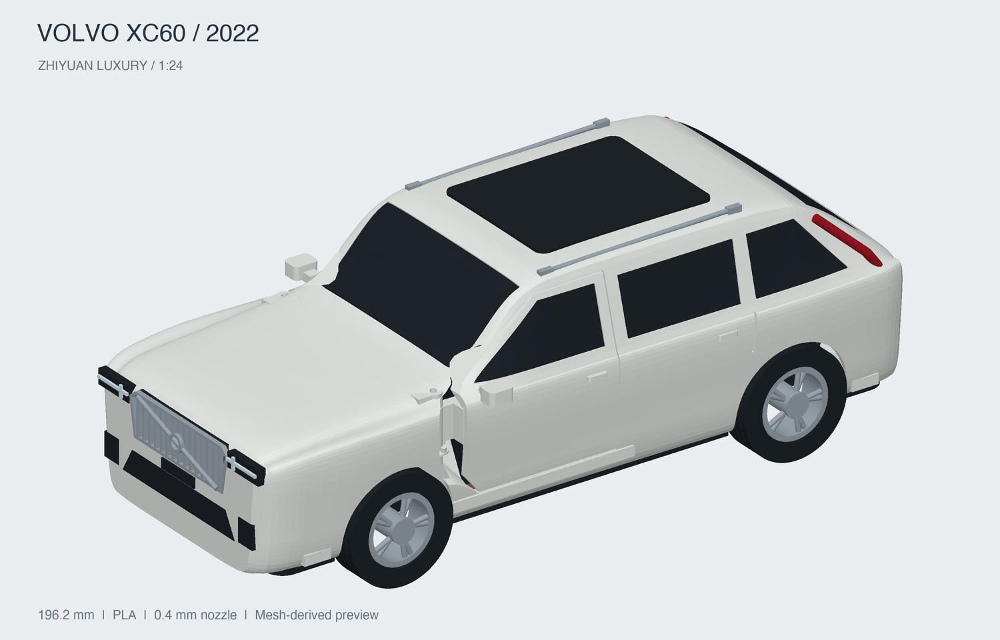

# Volvo XC60 2022 智远豪华版 · 装配展示

1:24 装配预览，可切换“闭门”和“双前门打开 60°”，查看分色零件、车轮与内饰位置。车身依据尺寸和照片近似重建，后门、尾门和机盖固定。

GLB 仅供展示，不用于打印。打印文件、五金和装配步骤请在模型列表选择 **“Volvo XC60 2022 智远豪华版 · FDM”** 并打开说明。

GLB 资源校验通过，展示资源来自已校验的打印模型。
