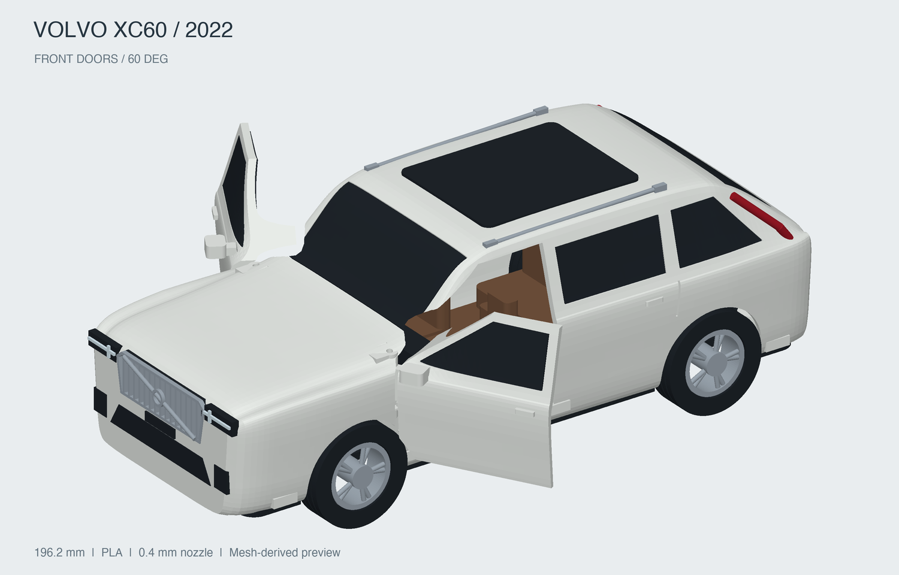
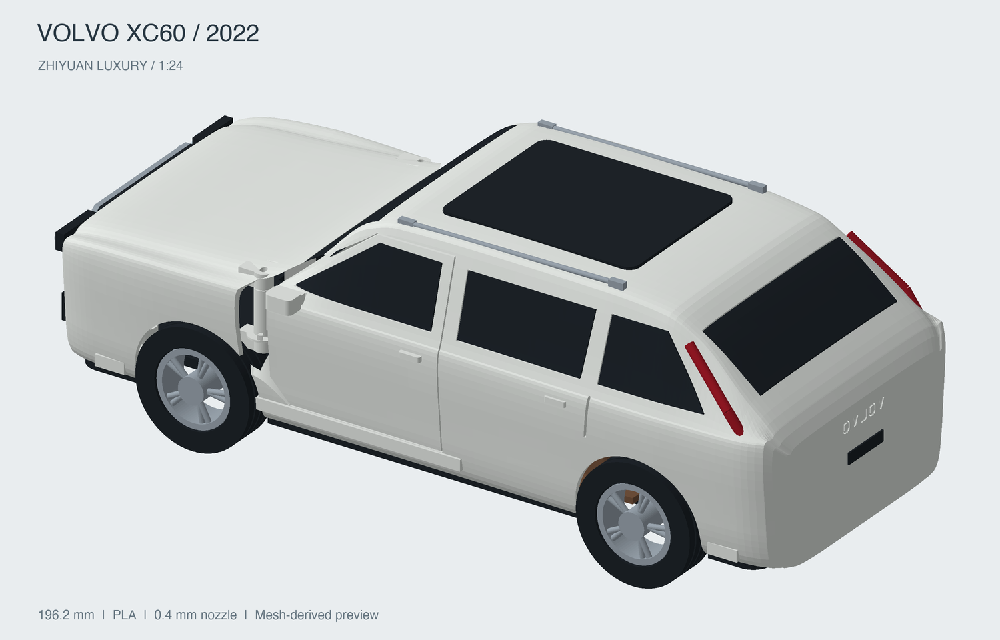
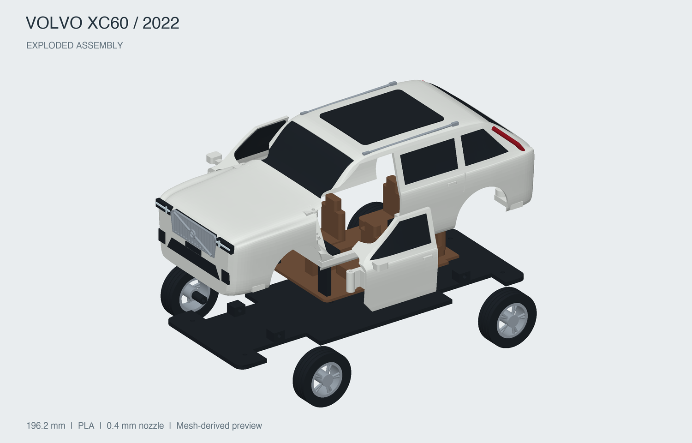

# Volvo XC60 2022 智远豪华版 · 装配展示

与打印模型使用相同零件的 1:24 装配预览。可切换“闭门”和“双前门打开 60°”，查看实际分色零件、车轮和内饰位置。


此条目是展示资源，GLB 不用于打印。打印 STL、试打件、五金清单和装配步骤请在模型列表选择 **“Volvo XC60 2022 智远豪华版 · FDM”** 后打开说明。

## 展示视图







车身曲面依据尺寸和照片近似重建。前门采用模型专用金属销轴铰链，后门、尾门和机盖固定。

## 验收状态

GLB 资源校验通过，装配资源来自已校验的打印模型。

## 维护与重建

先重建打印模型，再更新展示资源：

```sh
npm run models:build -- volvo-xc60-2022
npm run models:build -- volvo-xc60-2022-display
```

`src/build.py` 检查上游校验状态并复制装配 GLB 和预览图。
